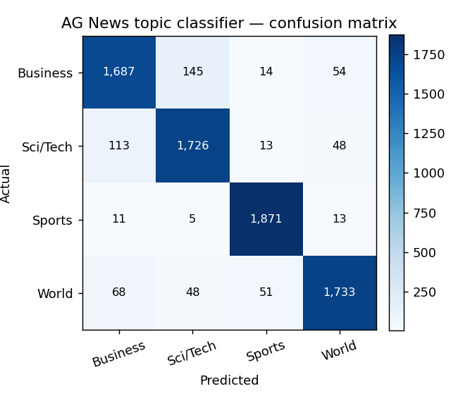
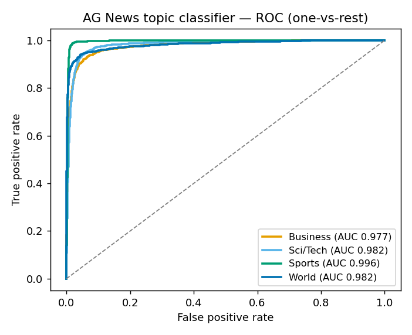

# NewsAgent AI — ML module

A Python / scikit-learn module that brings **machine-learning news
classification** to NewsAgent AI — analysing and scoring news stories with
trained models instead of LLM API calls.

## Models

| Model | Task | Type | Trained on |
|---|---|---|---|
| Topic classifier | World / Sports / Business / Sci-Tech | Classification | AG News — 120k articles |
| Domain classifier | Geopolitics / Markets / Technology / Health / Climate / Society | Classification | NewsAgent AI corpus |
| Severity classifier | CRITICAL / HIGH / MEDIUM / LOW | Classification | NewsAgent AI corpus |
| Urgency regressor | a 1–10 urgency score | Regression | NewsAgent AI corpus |

All four use **TF-IDF features** (unigrams + bigrams). The classifiers are
`LogisticRegression`; the urgency predictor is a `RandomForestRegressor`.
Models are evaluated on a held-out test set (and cross-validation for the
smaller corpus).

## Two data sources

1. **AG News** — a standard public benchmark of 120,000 labelled news
   articles. The topic classifier trains on it for a real, reproducible
   accuracy score.
2. **NewsAgent AI corpus** — the stories NewsAgent AI collects and auto-labels
   itself (`ml/data/corpus.csv` + `data/log.json`). It **grows every day** the
   deployed app runs, so re-running `train.py` keeps improving the domain,
   severity and urgency models.

## Pipeline

```
download_data.py / collect-corpus  →  datasets.py  →  train.py  →  models/  →  predict.py
   (get + label data)                  (loaders)      (train+eval)  (saved)     (inference)
```

## Usage

```bash
cd ml
python -m venv .venv && source .venv/bin/activate
pip install -r requirements.txt

python download_data.py      # fetch AG News (120k articles)
python train.py              # train + evaluate all models -> models/
python predict.py "Central bank raises interest rates to fight inflation"
```

`train.py` prints an EDA summary, per-model metrics and a classification
report, and writes `ml/models/metrics.json`.

To grow the NewsAgent AI corpus, run `npm run collect-corpus` from the project
root (limited by Gemini's free-tier quota of 20 requests/day).

## Evaluation results

Every number below is produced by `python train.py` (which also writes
`models/metrics.json`) and is fully reproducible from the committed data.

### Topic classifier — AG News benchmark

**TF-IDF (unigram + bigram) + Linear SVM**, trained on **120,000** labelled
articles and evaluated on the held-out **7,600**-article test set (balanced —
1,900 per class). The Linear SVM edges out the Logistic Regression baseline
(92.1%) on the same features.

| Metric | Score | What it means |
| --- | --- | --- |
| Accuracy | **92.3%** | fraction of articles labelled correctly |
| Macro F1 | **0.923** | F1 averaged evenly across the 4 topics |
| Weighted F1 | **0.923** | F1 weighted by class size |
| ROC-AUC (OvR, macro) | **0.984** | ranking quality — separating each topic from the rest |
| Cohen's κ | **0.898** | agreement vs chance — 0.90 is "almost perfect" |
| Matthews CorrCoef | **0.898** | balanced correlation across all four classes |

**Cross-validation (5-fold, stratified on the 120k training set)** confirms the
result is stable, not a lucky split:

| Metric | Mean ± Std |
| --- | --- |
| Accuracy | **0.921 ± 0.002** |
| Macro F1 | **0.921 ± 0.002** |

Per-class (precision / recall / F1):

| Class | Precision | Recall | F1 |
| --- | --- | --- | --- |
| Sports | 0.960 | 0.985 | **0.972** |
| World | 0.938 | 0.912 | **0.925** |
| Sci/Tech | 0.897 | 0.908 | **0.903** |
| Business | 0.898 | 0.888 | **0.893** |

Confusion matrix (rows = actual, cols = predicted):

| | → Business | → Sci/Tech | → Sports | → World |
| --- | --- | --- | --- | --- |
| **Business** | 1687 | 145 | 14 | 54 |
| **Sci/Tech** | 113 | 1726 | 13 | 48 |
| **Sports** | 11 | 5 | 1871 | 13 |
| **World** | 68 | 48 | 51 | 1733 |

Sports is cleanly separable (0.97 F1); the residual confusion is the expected
Business ↔ Sci/Tech overlap (business-of-tech stories), exactly where a
bag-of-words model is weakest.

Charts generated by `train.py` into [`ml/assets/`](assets/):

| Confusion matrix | ROC curves (one-vs-rest) |
| --- | --- |
|  |  |

### Domain & severity classifiers — self-collected corpus

Trained on NewsAgent AI's own **LLM-auto-labelled** corpus (**21 stories so
far** — genuinely small, so these are preliminary and improve every day the
deployed app collects more). Metrics are on a 25% held-out split:

| Model | Classes | Held-out accuracy | Macro F1 | CV accuracy |
| --- | --- | --- | --- | --- |
| Domain | 6 | 66.7% | 0.30 | — |
| Severity | 4 | 66.7% | 0.47 | 47.3% |
| Urgency (regressor) | 1–10 | skipped — needs ≥ 16 labelled rows | | |

> **On honesty:** these self-collected models are deliberately reported at their
> true small-data stage — a 21-story corpus can't yet support strong metrics, and
> we don't inflate them. (The separate 1,198-story warehouse is labelled by a
> keyword rule, so training on it would just measure a classifier relearning that
> rule — not reported here as skill.) The corpus grows daily; re-running
> `train.py` keeps improving them. **The AG News classifier is the headline,
> benchmark-grade result.**
